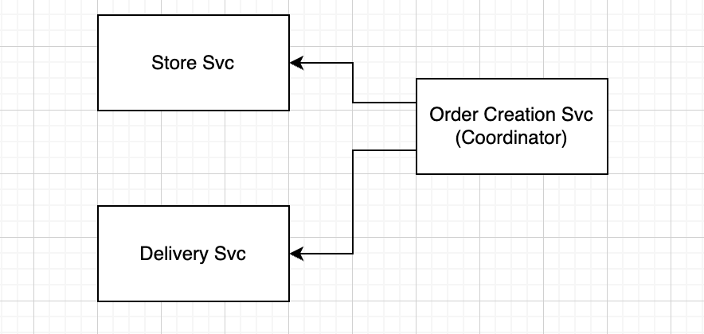

## OpenTelemetry Hands-on Example

This is a simple example of how to use OpenTelemetry to instrument a simple microservice based booking application.

### How to run

Run the application in the following order:

```bash
cd delivery-svc
go run main.go
```

```bash
cd store-svc
go run main.go
```

```bash
cd order-svc
go run main.go
```

### Communication of the application

